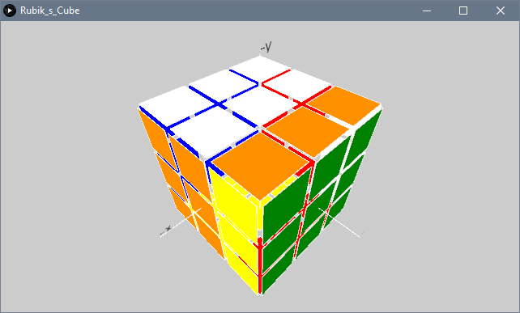

# Rubiks-cube-simulator

This program simulates a rubik’s cube in 3D, and allows the user to manipulate it using keyboard input.
An index of commands are listed below:

|Key                               |Function                                       |
|----------------------------------|-----------------------------------------------|
|‘f’                               |Rotates the front side clockwise               |
|‘r’                               |Rotates the right side clockwise               |
|‘u’                               |Rotates the up side clockwise                  |
|‘b’                               |Rotates the back side clockwise                |
|‘l’                               |Rotates the left side clockwise                |
|‘d’                               |Rotates the down side clockwise                |
|TAB + any of the above            |Rotates that side counter-clockwise            |
|SPACEBAR                          |Sets camera to default/front view              |
|UP, DOWN, LEFT, RIGHT             |Rotates camera around cube                     |
|ENTER                             |Finds solution for current cube for up 5 moves |

 After pressing enter, the optimal solution is then printed out in a format in which a capital letter represents
 the corresponding face to be turned clockwise; if a single quote (’) follows after, then the corresponding face
 should be turned counter-clockwise.
 
 Following the steps from left to right should lead to the solved cube.
 
|Colour|Side|
|-|-|
|Green|Front|
|Blue|Back|
|Orange|Left|
|Red|Right|
|White|Up|
|Yellow|Down|

 
 
 
 
 
 
 
 
 
